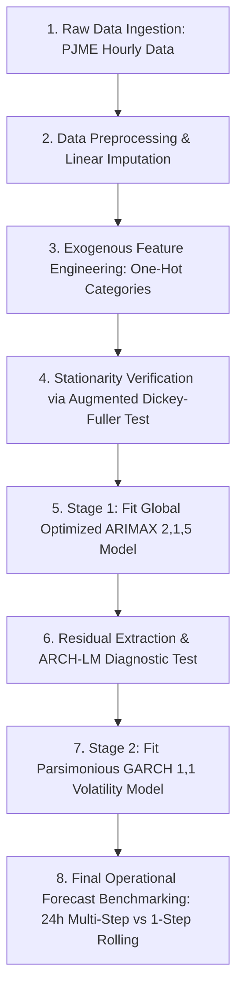

Forecasting Hourly Electricity Consumption in the PJM East Region Using a Two-Stage Hybrid ARIMAX - GARCH Model Integrated with Temporal Structural Variables.
# 👥 Authors & Acknowledgements

- **Researcher:** Doãn Quốc Bảo (Student ID: 11230519)
- **Cohort:** DSEB 65B (Data Science in Economics and Business)
- **Institution:** National Economics University (NEU), Hanoi, Vietnam
- **Course Instructor:** MS. Trần Thị Hà

*Developed as an academic research project in Time Series Analysis and Forecasting.*
# 📝 Project Overview
This repository contains the complete implementation of a **two-stage hybrid ARIMAX-GARCH forecasting framework** designed to predict high-frequency hourly electricity consumption in the **PJM East Region (PJME)** power grid. 

Hourly energy data poses two massive econometrics challenges:
1. **Multiple Seasonality:** Overlapping daily (24h), weekly (168h), and monthly cycles driven by human behavior and climate variations.
2. **Volatility Clustering:** Continuous blocks of massive forecasting errors occurring during severe weather shocks or sudden demand peaks, which violate classical homoskedastic errors assumptions.

To solve this, our pipeline leverages a decoupled hybrid approach combining **linear time-series tracking (ARIMAX)** and **conditional variance modeling (GARCH)**.

---

# ⚡ Key Methodology & Pipeline Stages


## 🔹 Stage 1: Conditional Mean Model — ARIMAX(2,1,5)

Instead of traditional SARIMA models which experience **numerical non-convergence** and a **"dimensionality explosion"** when expanding lag operators to accommodate weekly seasonality ($s = 168$), this pipeline projects the entire multi-layered temporal context into a full-rank, high-dimensional **deterministic exogenous matrix (X)**.

- Extracted time contexts:
  - Hour (0–23)
  - Day of week (0–6)
  - Month (1–12)

- Encoded using a full-rank **One-Hot Encoding** paradigm with $N-1$ columns dropped to eliminate the **Dummy Variable Trap** and multicollinearity.

- Optimized model order determined via a heuristic stepwise **Hyndman–Khandakar search** to minimize the **Akaike Information Criterion (AIC)**.

---

## 🔹 Stage 2: Conditional Variance Model — GARCH(1,1)

Linear models assume constant error variance over time. To verify this, **Engle's ARCH Lagrange Multiplier (ARCH-LM) test** is applied to the extracted ARIMAX residuals.

- A severe presence of conditional heteroskedasticity (p-value close to 0) demands a secondary modeling block.

- A parsimonious **GARCH(1,1)** specification with a Normal error distribution is estimated over the residuals via **Maximum Likelihood Estimation (MLE)** using the **BFGS optimization algorithm** to establish reliable time-varying confidence boundaries.

---

# 📈 Empirical Results & Evaluation

## 1️⃣ Stationarity (ADF Test)

The target load consumption series (`PJME_MW`) is verified via the **Augmented Dickey-Fuller (ADF)** test:

- **ADF Test Statistic:** -18.82891  
  *(well below the 1% critical threshold of -3.430395)*

- **Asymptotic p-value:** $2.022125 \times 10^{-30}$  
  *(rejection of the stochastic unit root null hypothesis)*

- **Note:** First-order differencing ($d=1$) is still enforced to improve optimization stability and address localized short-term drifts.

---

## 2️⃣ Model Optimization Highlights

- **Optimal Specification:** ARIMAX(2,1,5) paired with a decoupled GARCH(1,1).

- **AIC Objective Score:** Optimized down to a global baseline of **2,419,971.757**.

- **Volatility Dynamics:**
  - ARCH coefficient: $\alpha_1 = 0.7040$
  - GARCH coefficient: $\beta_1 = 0.0568$

  The high ARCH coefficient signals severe sensitivity to sudden external triggers, while the low GARCH coefficient indicates that grid volatility dissipates quickly once the anomaly passes.

---

## 3️⃣ Operational Forecasting Horizon Benchmarking

The framework is rigorously evaluated across two distinct operational execution strategies over the out-of-sample test partition.

| Forecasting Paradigm | Mean Absolute Error (MAE) | Linear Correlation Coefficient | Operational Context |
|---------------------|--------------------------|-------------------------------|--------------------|
| **24-Hour Ahead Frozen Multi-Step** | 4,411.82 MW | 0.9789 | Day-Ahead Energy Dispatch / Scheduling |
| **1-Step Ahead Adaptive Rolling** | 4,631.97 MW | 0.5410 | Real-Time Grid Control / Balancing |

### 💡 Key Practical Insight

For large-scale electricity grids embedded with rigid socio-economic schedules, the explanatory power of global deterministic multi-seasonality heavily outweighs local autoregressive dependencies.

The **1-step rolling approach** experiences severe autoregressive memory inertia and systemic phase lags during sudden load transitions, while the **frozen multi-step framework** tracks the global path and phase changes substantially better.

---

# 🛠 Repository Structure

```text
├── data/
│   └── PJME_hourly.csv          # Raw PJM East Region Hourly Electricity Load Dataset
├── full_pipeline.ipynb          # Complete Python Notebook (EDA, Modeling, Diagnostics)
├── README.md                    # Project Documentation (Auto-generated)
└── requirements.txt             # Required Packages for Environment Setup
```

---

# 🚀 Getting Started & Installation

## 1. Clone the Repository

```bash
git clone https://github.com/yourusername/pjme-electricity-forecasting.git
cd pjme-electricity-forecasting
```

## 2. Set Up a Virtual Environment

```bash
# Create environment
python -m venv venv

# Activate environment (macOS/Linux)
source venv/bin/activate

# Activate environment (Windows)
venv\Scripts\activate
```

## 3. Install Required Dependencies

```bash
pip install pandas numpy matplotlib statsmodels pmdarima arch scikit-learn scipy
```

## 4. Run the Pipeline

Open the notebook in your workspace (VS Code, Jupyter Lab) and execute all cells sequentially:

```bash
jupyter notebook full_pipeline.ipynb
```

---
